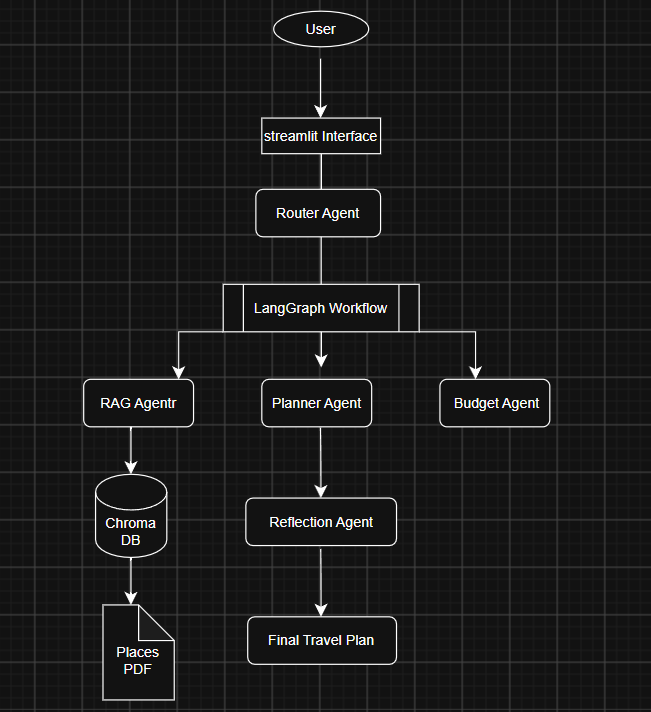
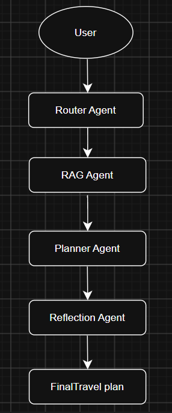
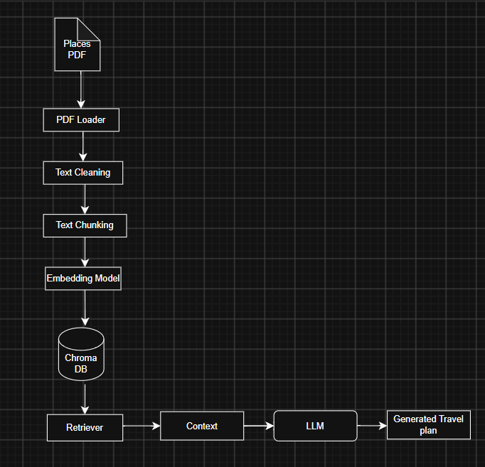

# ✈️ TripCraft AI - Agentic AI Travel Planner

## Project Description

TripCraft AI is an AI-powered travel planning application developed to help users create personalized travel plans for Sri Lankan destinations.

Planning a trip usually requires searching multiple websites for attractions, hotels, transportation, food recommendations, and travel information. This process can be time-consuming because travel information is distributed across different sources.

TripCraft AI provides an intelligent travel assistant where users can enter their travel requirements and receive a generated travel itinerary using Agentic AI, Retrieval-Augmented Generation (RAG), LangGraph, and Large Language Models (LLMs).

The system retrieves information from a Sri Lankan tourism knowledge base and uses multiple AI agents to generate structured travel recommendations.

---

# 🚀 Live Demo

Try the deployed TripCraft AI application:

🔗 Streamlit App:
https://tripcraftai-uwvlqvtzqnnttdvebknjjd.streamlit.app/


# Problem Statement

Travelers often need to collect information from different sources and manually organize their travel plans.

Finding suitable attractions, transportation options, accommodation information, and travel guidance for a destination requires significant time and effort.

TripCraft AI addresses this problem by retrieving relevant information from tourism documents and automatically generating personalized travel itineraries.

---

# Project Objectives

The main objectives of this project are:

- Develop an AI-based travel planning assistant.
- Generate personalized travel itineraries.
- Use tourism documents as a reliable knowledge source.
- Implement Retrieval-Augmented Generation (RAG).
- Apply multiple AI agents using LangGraph.
- Improve generated responses using a reflection-based checking process.
- Provide a simple and user-friendly Streamlit interface.

---

# System Architecture

The overall architecture of TripCraft AI is shown below:

<p align="center">

</p>

The system receives user requests through the Streamlit interface.

LangGraph manages the workflow and coordinates communication between AI agents, the RAG pipeline, and Large Language Models.

---

# Agent Workflow

The communication flow between TripCraft AI agents is shown below:

<p align="center">

</p>

The workflow consists of:

- Router Agent
- RAG Agent
- Planner Agent
- Reflection Agent

LangGraph controls the execution order and manages information flow between these agents.

---

# AI Agents

## 1. Router Agent

The Router Agent receives the user's travel request and identifies the required travel planning task.

It helps determine the appropriate workflow for processing user queries.

Implemented in:

```
agents.py
```

---

## 2. RAG Agent

The RAG Agent retrieves relevant information from the Sri Lankan tourism knowledge base.

It uses ChromaDB similarity search to find useful document sections related to the user's request.

Implemented in:

```
agents.py
```

---

## 3. Planner Agent

The Planner Agent generates the main travel itinerary using:

- User travel requirements
- Retrieved tourism information
- Available destination knowledge

The agent creates structured travel plans including:

- Places to visit
- Suggested activities
- Travel recommendations
- Day-wise schedules

Implemented in:

```
agents.py
```

---

## 4. Reflection Agent

The Reflection Agent reviews the generated travel plan and improves:

- Organization
- Readability
- Completeness
- Travel suitability

This step improves the quality of the final response.

Implemented in:

```
agents.py
```

---

# Agentic AI Design Patterns Used

## Planning Pattern

The Planner Agent follows the planning pattern by converting user requirements into a structured travel itinerary.

---

## Reflection Pattern

The Reflection Agent reviews and improves the generated travel plan before presenting the final output.

---

## Router / Orchestrator Pattern

LangGraph acts as the workflow controller by managing communication and execution between different agents.

Implemented in:

```
graph.py
```

---

# Model Selection Strategy

Different Large Language Models are selected for different tasks.

| Task | Model | Reason |
|---|---|---|
| Query Routing | Llama-3.1-8B-Instant (Groq) | Fast decision making |
| Travel Plan Generation | Llama-3.3-70B-Versatile (Groq) | Better reasoning and detailed generation |
| Plan Reflection | Llama-3.1-8B-Instant (Groq) | Efficient response checking |

This approach balances:

- Response quality
- Processing speed
- Computational efficiency

---

# Retrieval-Augmented Generation (RAG)

TripCraft AI uses a Sri Lankan tourism knowledge base containing travel-related documents.

The knowledge base includes:

- Destination guides
- Tourist attractions
- Hotels
- Transportation information
- Food guides
- Hiking locations
- Wildlife information
- Safety recommendations

---

# RAG Pipeline

The Retrieval-Augmented Generation pipeline used in TripCraft AI is shown below:

<p align="center">

</p>

The RAG pipeline performs:

- Document loading
- Text processing
- Text chunking
- Embedding generation
- Vector storage
- Similarity retrieval
- Context generation for AI agents

---

# RAG Configuration

## Document Collection

The system uses a Sri Lankan tourism knowledge base containing PDF documents.

The dataset contains information about:

- Popular destinations
- Attractions
- Hotels
- Transport routes
- Food recommendations
- Travel guidance

---

## Text Chunking

Documents are divided into smaller sections to improve retrieval performance.

Configuration:

```
Chunk Size: 800
Chunk Overlap: 150
```

---

## Embedding Model

The system uses:

```
sentence-transformers/all-MiniLM-L6-v2
```

for generating document embeddings.

---

## Vector Database

The vector database used is:

```
ChromaDB
```

ChromaDB stores document embeddings and performs semantic similarity search.

---

# Application Testing

The application was tested using different travel requests.

---

## Test Case 1: Kandy 2 Day Travel Plan

User Input:

```
Create a 2 day travel plan for Kandy
```

Generated output includes:

```
Day 1:
- Cultural attractions
- Historical locations
- Local experiences

Day 2:
- Additional sightseeing locations
- Food recommendations
- Travel suggestions
```

---

## Test Case 2: Sigiriya Day Trip

User Input:

```
Plan a Sigiriya day trip
```

Generated output includes:

```
- Sigiriya Rock Fortress information
- Nearby attractions
- Suggested visiting schedule
- Travel recommendations
```

---

## Test Case 3: Ella Travel Plan

User Input:

```
Give me a 3 day Ella itinerary
```

Generated output includes:

```
- Hiking locations
- Scenic attractions
- Local experiences
- Suggested activities
```

---

# Streamlit Application

TripCraft AI provides a web interface developed using Streamlit.

Users can:

- Enter travel requests.
- Generate AI travel plans.
- View structured itineraries.

Main features:

- 🌴 AI travel assistant
- ✈️ Travel request input
- 🤖 Agent-based planning
- 📋 Automated itinerary generation

---

# Live Demo

Streamlit Community Cloud:

```
https://tripcraftai-uwvlqvtzqnnttdvebknjjd.streamlit.app/
```

---

# Project Structure

```
TripCraft_AI/

│
├── app.py
│     Streamlit application
│
├── agents.py
│     AI agent implementation
│
├── graph.py
│     LangGraph workflow
│
├── rag.py
│     RAG pipeline
│
├── assets/
│     ├── SystemArchitecture.png
│     ├── Agent.png
│     └── RAG.png
│
├── data/
│     Tourism PDF documents
│
└── requirements.txt
      Required libraries
```

---

# Technologies Used

- Python
- Streamlit
- LangChain
- LangGraph
- Groq API
- Llama Models
- HuggingFace Embeddings
- ChromaDB
- Retrieval-Augmented Generation (RAG)

---

# Installation and Setup

## Clone Repository

```bash
git clone https://github.com/natheera-asra/TripCraft_AI.git
```

## Navigate to Project Folder

```bash
cd TripCraft_AI
```

## Install Dependencies

```bash
pip install -r requirements.txt
```

## Configure API Key

Create an environment variable:

```bash
export GROQ_API_KEY="your_api_key"
```

## Run Application

```bash
streamlit run app.py
```

---

# Limitations

- The system supports only Sri Lankan destinations available in the uploaded tourism knowledge base.
- It does not retrieve live information from external websites.
- Real-time weather information is not included.
- Hotel booking and transport booking features are not available.
- The quality of generated plans depends on the available tourism documents.
- Retrieval is based on semantic similarity, so queries with limited context may sometimes retrieve less relevant information.
- For example, a Sigiriya query may retrieve information from another destination if similar descriptions exist in the knowledge base.
- Metadata-based filtering can be added in future versions to improve destination accuracy.

---

# Future Improvements

Future improvements include:

- Adding real-time weather APIs.
- Integrating hotel booking services.
- Adding transport APIs.
- Expanding the tourism knowledge base.
- Supporting multiple languages.
- Developing a mobile application.
- Improving destination-based retrieval accuracy.
- Adding user preference learning.

---

# Developer

**Natheera Asra**

Project:

**TripCraft AI - Agentic AI Travel Planner**

---

# Conclusion

TripCraft AI demonstrates how Agentic AI and Retrieval-Augmented Generation can be applied to intelligent travel planning.

By combining AI agents, LangGraph workflow management, vector databases, embeddings, and Large Language Models, the system generates personalized travel recommendations from a Sri Lankan tourism knowledge base.

Although the current system is limited to information available in the document collection, it provides a foundation for developing advanced AI-powered travel assistants.
